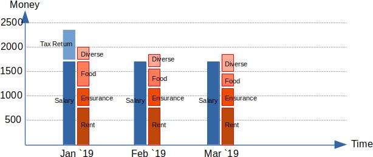

# financial-viewer

financial-viewer is a tool to visualize your earnings and spendings per month,
thus giving you an overview of your financial situation and your balance.
financial-viewer encourages you to explore possibilities for savings or investments.

You can load one or multiple bank account statements into the program
and enter single transactions manually.
Earnings and spendings will be displayed in your dash board in columns next to each other.

## Installation and Usage

Installation:
- Install python3 and the dash plotting library with `pip3 install dash==1.8.0`.
- Download this repository.

Run an example:
- In the repos root folder, run `python3 plot.py`.
- In your browser, open `http://127.0.0.1:8050`. There you see the dash board.
- In the file upload dialoge on top of the dash board, choose one or more
  of the provided example bank account statements from the folder `samples`.
- Enter some transactions manually on the bottom of the dash board.
- Explore the generated graph:
  - Hover over a bar to see the values.
  - Select a region to zoom in.
  - Double click to zoom out.

Get your own data:
- In your online banking, find a way to export your bank account statements into a .csv file. Save it to your computer.
- Open financial-viewer as explained above and load your own data in the file menu.

## Limitations and Ways to Contribute

This project is in its beginning and I am very thankful to contributers.
You can submit a pull request or send me a message.

These are some ways financial-viewer can improve:
- Import more data formats.

  At the moment only CAMT format with German captions can be parsed.
  financial-viewer needs more languages and formats available. And a way to automatically detect them.

  You can also send a sample of the format of your bank account statement file, so I can implement the parser.
  But please clear it of ALL real data like names, account numbers and the like before sending.

- Make financial-viewer accessible for people without computer science knowledge.

  At the moment you need to use a command line to start financial-viewer.
  A simple install program and a start program usable by double click would be awesome!

- Save all loaded data into a new file and maybe protect it with a password.

  The idea is to collect all data from the bank account statements and from the manual text field into a single data base for the user.
  Since this data base contains sensitive data an encryption mechanism would be great.
  There is a button at the bottom of the dash board which says "save file" but it still has no function.

- Automatically sort the transactions into categories and display them stacked per month.

  This is complicated but usefull in the long run. Maybe some meta data of the transactions can help:
  Initially sort between one time transactions and periodic transactions?

